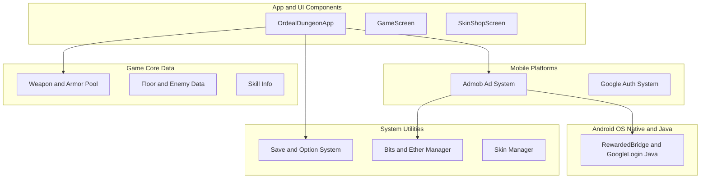

```mermaid
graph TD

    subgraph UI_Package [App and UI Components]
        App[OrdealDungeonApp]
        GameScr[GameScreen]
        SkinShopScr[SkinShopScreen]
    end

    subgraph Core_Package [Game Core Data]
        WeaponData[Weapon and Armor Pool]
        FloorData[Floor and Enemy Data]
        SkillData[Skill Info]
    end

    subgraph System_Package [System Utilities]
        SaveSys[Save and Option System]
        BitsMgr[Bits and Ether Manager]
        SkinMgr[Skin Manager]
    end

    subgraph Mobile_Package [Mobile Platforms]
        AdSys[Admob Ad System]
        GoogleAuth[Google Auth System]
    end

    subgraph Android_Native [Android OS Native and Java]
        J_Bridge[RewardedBridge and GoogleLogin Java]
    end

    App --> WeaponData

    App --> SaveSys

    App --> AdSys

    AdSys --> BitsMgr

    AdSys --> J_Bridge
```
